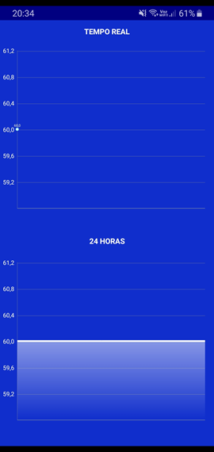

# Power Quality Analyzer

This repository contains an Android application developed for power quality analysis. The application was developed using Android Studio with Java, making it exclusive to the Android platform.

## Repository Structure

- **app:** Contains the Android application code.
- **images:** Contains images used in the README.
- **SeMicro-PR_-_2021_paper_16.pdf:** Contains project documentation file.

## Getting Started

To run the Android application:

1. Clone this repository.
2. Open the project in Android Studio.
3. Connect your Android device or use an emulator.
4. Build and run the application.

## Screenshots

*Welcome Screen*

*User Registration*

*Real-time Visualization*

*About Section*

*Database Structure*
